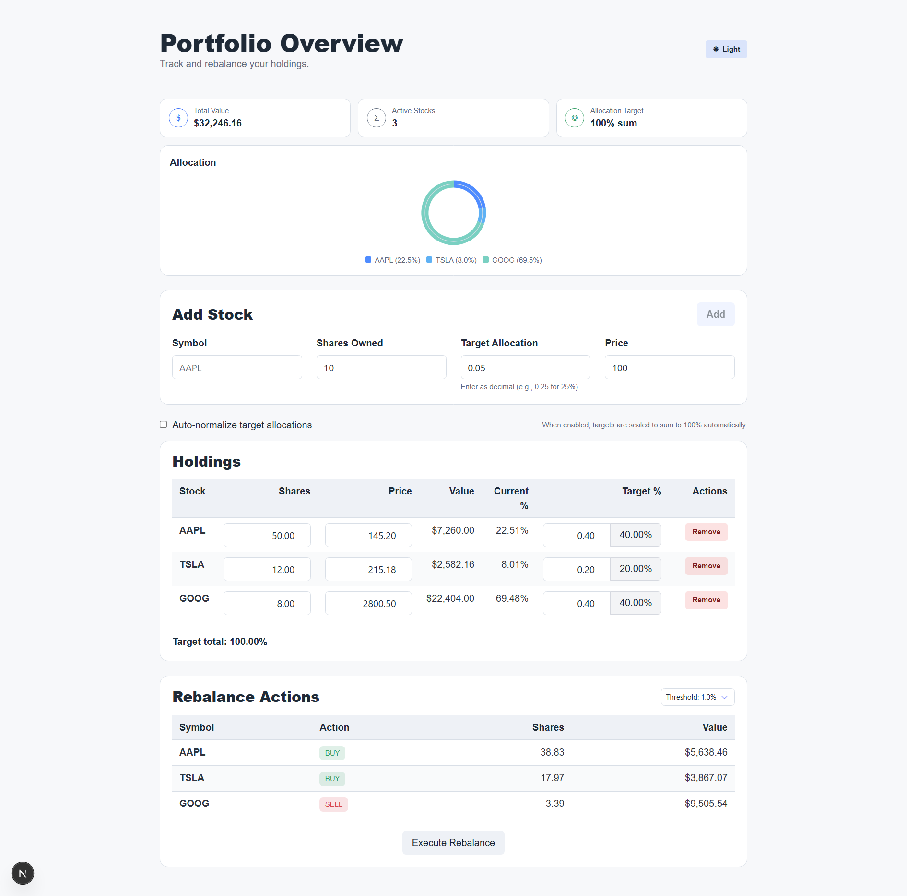

# Portfolio Rebalancer

This project implements a **simple portfolio rebalancing engine** with a UI layer to visualize allocations, drift, and suggested trades in real time.
Real demo https://jeaneths.github.io/Fintual-Challenge/



---

## Core Concepts

### What is portfolio rebalancing?

Portfolio rebalancing compares:
- what you **currently own** (shares × price)
- versus what you **want to own** (target allocation %)

It then calculates which assets need to be **bought** or **sold** to match the desired distribution.
---

## Core Domain Interfaces

### `Stock`

```ts
export interface Stock {
  symbol: string;
  getCurrentPrice: () => number;
}
```

**Design decision:**  
`Stock` is an interface instead of a class to keep the core logic simpler.

---

### `PortfolioStock`

```ts
export interface PortfolioStock {
  stock: Stock;
  sharesOwned: number;
  targetAllocation: number;
}
```

This interface represents a stock inside a user’s portfolio.

Fields:
- `sharesOwned`: allows fractional shares
- `targetAllocation`: decimal fraction (`0.25` = 25%)

**Why decimals instead of percentages?**  
Using `0–1` avoids repeated division by 100 and reduces rounding errors, that happened when I began testing.

---

### `RebalanceAction`

```ts
export interface RebalanceAction {
  symbol: string;
  action: 'BUY' | 'SELL';
  shares: number;
  value: number;
}
```

This is a **pure data structure**, not a class.

**Design decision:**  
An interface is used because it was easier to return in the rebalance method and maps cleanly to UI tables.

---

## Portfolio Class

### Constructor & Allocation Validation

```ts
constructor(private stocks: PortfolioStock[]) {
  this.validateAllocations();
}
```

When a `Portfolio` is created, it immediately validates that all target allocations sum to 100%.

```ts
private validateAllocations(): void {
  const sum = this.stocks.reduce((s, stock) => s + stock.targetAllocation, 0);
  if (Math.abs(sum - 1.0) > 0.00001) {
    throw new Error(`Total must be 100%, but total is ${(sum * 100).toFixed(1)}%`);
  }
}
```

**Why `0.00001`?**  
Floating point math is imprecise.  
This prevents valid allocations like `0.1 + 0.2 + 0.7` from failing due to rounding errors, that I found in the first implementation.

---

### Total Portfolio Value

```ts
private calculateTotalValue(): number {
  return this.stocks.reduce((total, s) => {
    return total + (s.sharesOwned * s.stock.getCurrentPrice());
  }, 0);
}
```
This calculates the current market value of the portfolio.

---

### Rebalance Algorithm

```ts
public rebalance(): RebalanceAction[] {
  const totalValue = this.calculateTotalValue();

  let rebalancedPortfolio: RebalanceAction[] = this.stocks
    .map(portfolioStock => {
      const price = portfolioStock.stock.getCurrentPrice();
      const currentValue = portfolioStock.sharesOwned * price;
      const targetValue = totalValue * portfolioStock.targetAllocation;
      const valueGap = targetValue - currentValue;

      const action: RebalanceAction["action"] =
        valueGap > 0 ? 'BUY' : 'SELL';

      return {
        symbol: portfolioStock.stock.symbol,
        action,
        shares: Math.abs(valueGap) / price,
        value: Math.abs(valueGap)
      };
    })
    .filter(action => action !== null);

  return rebalancedPortfolio;
}
```
This compares current holdings vs. target goals and return trades done, those depends if the gap between current and target stock value, basically if we want more we buy and if we have too much we sell.  
---

## UI Layer

The user interface was created with the help of **Windsurf**, using this core library as the single source of truth, here is the chat log to consult it [chat log](app/Portfolio Rebalancing Tool.md)

### UI Capabilities

The UI allows users to:
- add new stocks
- delete existing stocks
- adjust target allocations
- view allocation charts in real time
- see rebalance actions immediately
- execute a rebalance and observe updated allocations

A visual-first approach was intentionally chosen to make:
- portfolio drift
- over/under-allocation
- rebalance impact
easy to understand.

---

## To localy run

First, run the development server:

```bash
npm run dev
# or
yarn dev
# or
pnpm dev
# or
bun dev
```

Open [http://localhost:3000](http://localhost:3000) with your browser to see the result.
